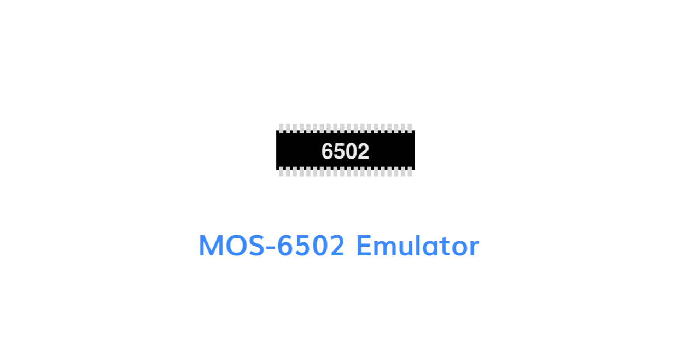
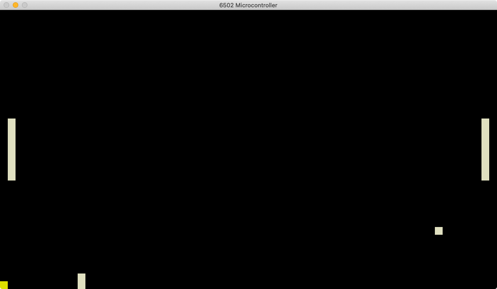

# MOS-6502 Emulator

This is a complete emulator of the original MOS Technology 6502 microcontroller from 1975.
It is written in C++.

The emulator works by providing a shared memory bus, to which one can connect devices.
Each device is allocated an address range, in which it can provide its functionality.
This allows the program to change audio-output and draw graphics by simply writing a value to a specific address.

Below you can see the virtual monitor displaying a pong game. The game is implemented completely in the
6502-Assembly language.

# Custom modifications

Since the original 6502 didn't use all available opcodes, a custom one was added.
You can see a list of unused 6502 opcodes [here](http://www.oxyron.de/html/opcodes02.html).

Instead of halting the CPU, it now waits until the next interrupt happens.

- `0x02 - WAI` Same behaviour as on the WDC 65C02.

# Contributors

- Leonard Schütz, Lead Developer [@KCreate](https://github.com/KCreate)

# License

[MIT License](LICENSE.md)
